# 🎓 Hệ Thống Quản Lý & Tính Tiền Dạy Giáo Viên
### 📌 Đồ án Môn học: Đảm bảo Chất lượng & Kiểm thử Phần mềm (Software Testing & Evaluation)
**Mã lớp học phần / Nhóm thực hiện:** N01 - Nhóm 07 (Nhóm 11)  
**Phiên bản:** v4.0.0 (Tích hợp CSDL SQLite Prisma, UI/UX Hiện đại, Bộ kiểm thử tự động Selenium WebDriver & Apache JMeter)

---

[](https://nextjs.org/)
[](https://react.dev/)
[](https://www.typescriptlang.org/)
[](https://www.prisma.io/)
[](https://jestjs.io/)
[-43B02A?style=flat-square&logo=selenium)](https://www.selenium.dev/)
[](https://jmeter.apache.org/)
[](https://github.com/)

---

## 📖 Mục lục

1. [Giới thiệu Dự án](#-giới-thiệu-dự-án)
2. [Thiết kế Giao diện & Trải nghiệm Người dùng (UI/UX Showcase)](#-thiết-kế-giao-diện--trải-nghiệm-người-dùng-uiux-showcase)
   - [Triết lý Thiết kế & Design System](#triết-lý-thiết-kế--design-system)
   - [Kiến trúc Layout & Tính năng Tương thích](#kiến-trúc-layout--tính-năng-tương-thích)
   - [Thư viện Ảnh chụp Giao diện Thực tế](#thư-viện-ảnh-chụp-giao-diện-thực-tế)
   - [Các Điểm sáng về Trải nghiệm Người dùng (UX Highlights)](#các-điểm-sáng-về-trải-nghiệm-người-dùng-ux-highlights)
3. [Kiến trúc Hệ thống & Công nghệ Áp dụng](#-kiến-trúc-hệ-thống--công-nghệ-áp-dụng)
4. [Danh mục Màn hình & Nghiệp vụ](#-danh-mục-màn-hình--nghiệp-vụ)
5. [Công thức & Quy chuẩn Nghiệp vụ Tính Tiền Dạy](#-công-thức--quy-chuẩn-nghiệp-vụ-tính-tiền-dạy)
6. [Hướng dẫn Cài đặt & Khởi chạy Nhanh](#-hướng-dẫn-cài-đặt--khởi-chạy-nhanh)
7. [Hướng dẫn Kiểm thử Toàn diện (QA & Automation Tests)](#-hướng-dẫn-kiểm-thử-toàn-diện-qa--automation-tests)
   - [Kiểm thử Đơn vị & Độ bao phủ (Jest Unit Test & Coverage)](#1-kiểm-thử-đơn-vị--độ-bao-phủ-jest)
   - [Kiểm thử Giao diện Tự động (YC7 - Selenium WebDriver)](#2-kiểm-thử-giao-diện-tự-động-yc7---selenium-webdriver)
   - [Kiểm thử Hiệu năng & Chịu tải (YC8 - Apache JMeter)](#3-kiểm-thử-hiệu-năng--chịu-tải-yc8---apache-jmeter)
   - [Chạy Toàn bộ Pipeline Kiểm thử Local](#4-chạy-toàn-bộ-pipeline-kiểm-thử-local)
8. [Tích hợp Liên tục (CI/CD Workflow)](#-tích-hợp-liên-tục-cicd-workflow)
9. [Cấu trúc Thư mục Dự án](#-cấu-trúc-thư-mục-dự-án)
10. [Danh mục Hồ sơ & Bằng chứng Kiểm thử (Artifacts Traceability)](#-danh-mục-hồ-sơ--bằng-chứng-kiểm-thử-artifacts-traceability)

---

## 🌟 Giới thiệu Dự án

Dự án **Phần mềm Tính tiền dạy cho Giáo viên** là một hệ thống phần mềm quản lý đào tạo và thù lao giảng dạy chuyên sâu dành cho các trường đại học/cao đẳng, được xây dựng theo chuẩn chất lượng phần mềm (Software Quality Assurance). Hệ thống giải quyết trọn vẹn bài toán:
- Quản lý hồ sơ giáo viên, bằng cấp, khoa viện, học phần, kỳ học và lớp học phần.
- Phân công giảng dạy linh hoạt giữa giảng viên cơ hữu và giảng viên thỉnh giảng.
- Thiết lập bảng định mức tiết, bảng hệ số bằng cấp, bảng hệ số lớp đông sinh viên theo từng năm học.
- Tự động hóa quá trình tính toán tiền thù lao giảng dạy một cách chính xác, minh bạch, bảo vệ dữ liệu trước các trường hợp thiếu cấu hình.
- Cung cấp các báo cáo tổng hợp và chi tiết, hỗ trợ trích xuất dữ liệu ra file CSV hoặc in ấn/lưu trữ định dạng PDF theo chuẩn khổ giấy A4.

Dự án đáp ứng đầy đủ chuỗi yêu cầu kiểm định từ **YC1 đến YC9** bao gồm tài liệu đặc tả SRS, Test Plan SQA, Ma trận truy vết, Unit Test Jest (đạt 100% core logic), UI Automation bằng Selenium WebDriver và Performance Test bằng Apache JMeter.

---

## 🎨 Thiết kế Giao diện & Trải nghiệm Người dùng (UI/UX Showcase)

### Triết lý Thiết kế & Design System

Giao diện của ứng dụng được xây dựng theo phong cách **Enterprise Modern Dashboard** – đề cao tính trực quan, sang trọng, khoa học và dễ sử dụng cho cán bộ quản lý đào tạo và kế toán tài chính.

| Thành phần | Quy cách thiết kế | Mục đích trải nghiệm (UX) |
|---|---|---|
| **Màu sắc chủ đạo (Primary)** | Royal Blue (`#2563eb`), Dark Navy (`#0f172a`) | Tạo cảm giác tin cậy, chuyên nghiệp của hệ thống tài chính giáo dục |
| **Màu nền & Thẻ (Surface)** | Nền sáng (`#f5f7fb`), Thẻ (`#ffffff`), Viền xám nhạt (`#e5e7eb`) | Tăng độ tương phản, làm nổi bật thông tin dữ liệu bảng biểu, giảm mỏi mắt khi làm việc lâu |
| **Màu ngữ cảnh (Semantic)** | Green (`#16a34a` - Thành công), Red (`#dc2626` - Cảnh báo/Lỗi), Amber (`#d97706` - Chờ xử lý) | Phản hồi tức thì trạng thái nghiệp vụ và cảnh báo dữ liệu không hợp lệ |
| **Kiểu chữ (Typography)** | Phân cấp phân minh: Eyebrow nhỏ viết hoa $\to$ H1 đậm $\to$ H2 rõ ràng $\to$ Nội dung $\ge 14$px | Người dùng dễ dàng nắm bắt cấu trúc trang trong 3 giây đầu tiên |
| **Thành phần tương tác** | Nút bấm bo tròn 10px, hiệu ứng đổ bóng mờ (`subtle elevation`), hover chuyển động mượt | Mang lại trải nghiệm phản hồi vật lý sống động và tự nhiên |

---

### Kiến trúc Layout & Tính năng Tương thích

1. **App Shell Bền vững:**
   - **Sidebar cố định (260px):** Phân nhóm danh mục khoa học (*Tổng quan, Quản lý giáo viên, Quản lý lớp học phần, Tính tiền dạy, Báo cáo & Hệ thống*). Đánh dấu rõ ràng mục đang được chọn (`active state`).
   - **Topbar tiện ích:** Hiển thị thời gian thực thông tin tài khoản đang đăng nhập kèm vai trò (`Admin` hoặc `Tester`), nút đăng xuất nhanh.
2. **Khả năng tương thích Đa thiết bị (Responsive Design):**
   - Hỗ trợ tối ưu trên Desktop màn hình rộng, Laptop, và tự động thu gọn sidebar thành Menu di động (Mobile Drawer) trên màn hình $\le 1100$px.
3. **Chế độ In ấn Chuyên nghiệp (`@media print`):**
   - Tự động ẩn toàn bộ sidebar điều hướng, topbar, thanh công cụ tìm kiếm và nút bấm khi người dùng nhấn `Ctrl + P` hoặc nút In báo cáo. Bảng dữ liệu tự động dàn phẳng theo chuẩn khổ giấy A4 để ký duyệt.

---

### Thư viện Ảnh chụp Giao diện Thực tế

Dưới đây là hình ảnh thực tế ghi nhận từ phiên bản đang chạy của hệ thống:

#### 1. Màn hình Đăng nhập & Xác thực Người dùng
Giao diện đăng nhập hiện đại với dải chuyển màu Deep Navy - Blue, kiểm tra quyền truy cập nghiêm ngặt và hỗ trợ cơ chế HttpOnly Cookie bảo mật cao.

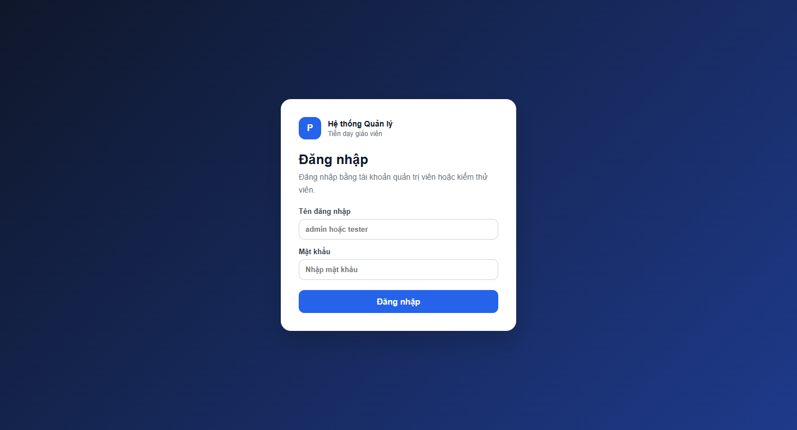

---

#### 2. Bảng Điều khiển Trung tâm (Dashboard & KPIs)
Cung cấp góc nhìn tổng quan thông qua 4 thẻ thống kê then chốt (*Tổng số GV, Lớp học phần, Phân công, Tổng kinh phí mẫu*), quy trình nghiệp vụ dạng mốc thời gian (Timeline) và công thức tính tiền trực quan.

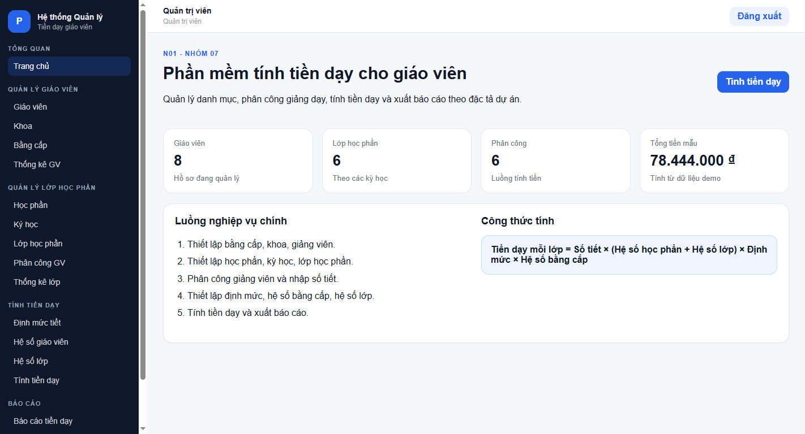

---

#### 3. Quản lý Hồ sơ Giáo viên & Bằng cấp
Giao diện kết hợp 2 cột: form thêm mới/chỉnh sửa với đầy đủ kiểm tra định dạng (Email, SĐT, Ngày sinh, Khoa, Học vị) cùng bảng danh sách hỗ trợ tìm kiếm tức thì.

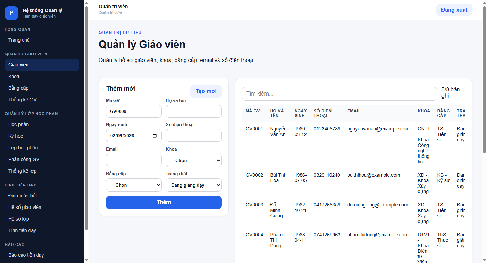

---

#### 4. Quản lý Lớp học phần & Công cụ Sinh mã theo Lô
Cho phép quản lý danh mục lớp học phần, sĩ số sinh viên, và tích hợp công cụ sinh hàng loạt lớp học phần tự động tăng mã (ví dụ: `CNTT01`, `CNTT02`, `CNTT03`...) chỉ với 1 cú nhấp chuột.

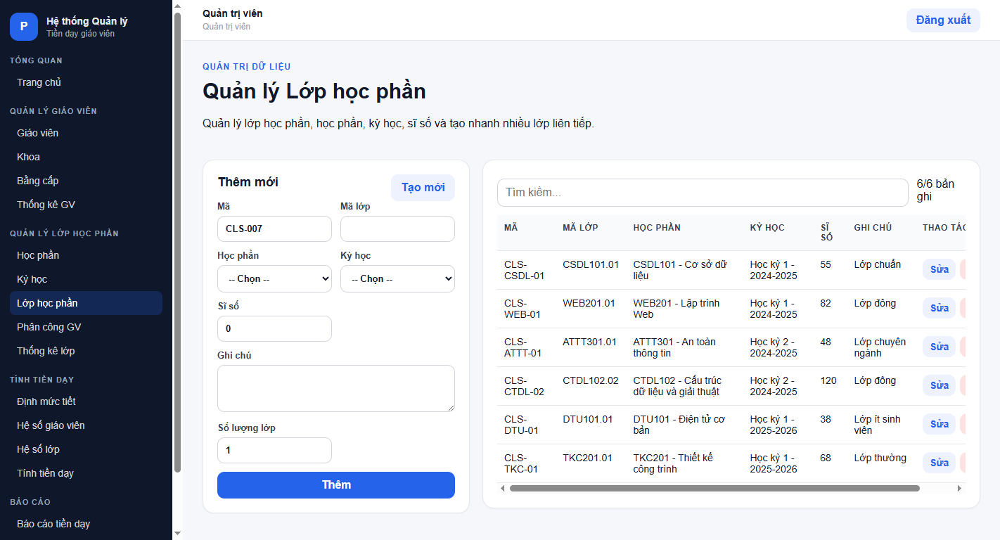

---

#### 5. Phân công Giảng viên Giảng dạy
Giao diện ghép nối giáo viên với lớp học phần, ghi nhận số tiết được phân công, hỗ trợ kiểm tra ràng buộc khoa và trạng thái hoạt động của giảng viên.

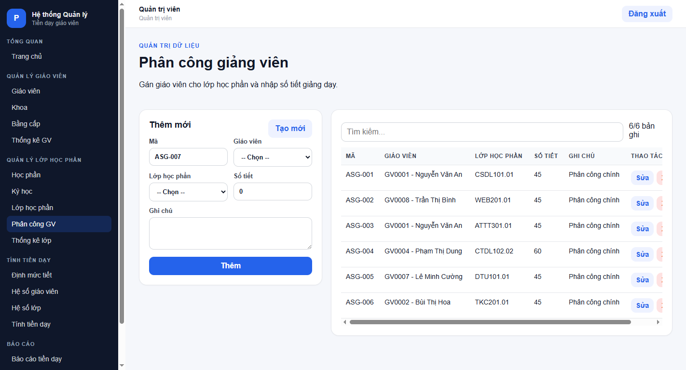

---

#### 6. Tính toán Tiền dạy Tự động & Cảnh báo An toàn
Bảng tính tiền chi tiết áp dụng công thức đầy đủ các hệ số. Hệ thống tích hợp cơ chế bảo vệ an toàn: hiển thị cảnh báo chi tiết nếu phát hiện lớp học thiếu định mức hoặc chưa có hệ số bằng cấp, không làm gián đoạn toàn hệ thống.

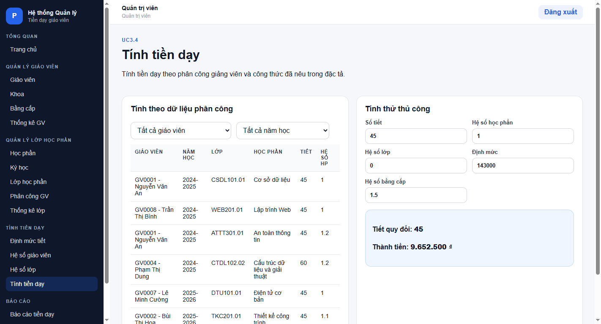

---

#### 7. Báo cáo Tiền dạy, Xuất CSV & In/Lưu PDF
Hệ thống báo cáo đa chiều hỗ trợ lọc theo từng Khoa và Kỳ học. Cho phép xuất toàn bộ số liệu ra định dạng bảng tính CSV hoặc xuất bản in/PDF chuẩn hóa cho phòng Kế hoạch - Tài chính.

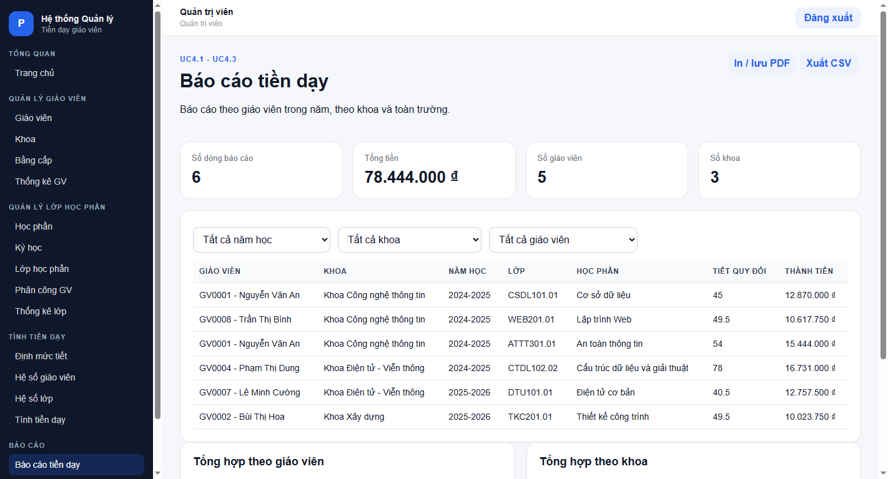

---

#### 8. Thống kê Chi tiết Giáo viên & Phân bố Học vị
Trang phân tích trực quan tổng số tiết giảng dạy, số lớp đảm nhiệm và cơ cấu học vị của đội ngũ giảng viên từng khoa phòng.

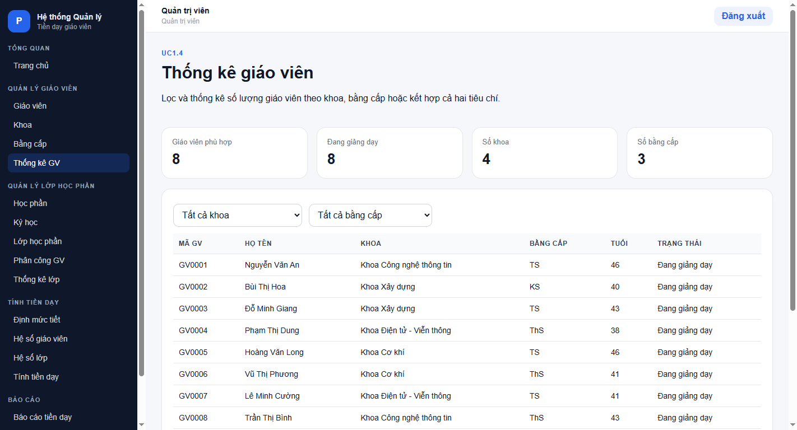

---

#### 9. Thiết lập Bảng Định mức Tiết & Hệ số Phức hợp
Hỗ trợ cấu hình định mức thù lao cơ bản cho từng năm học và kỳ học; thiết lập hệ số quy đổi theo quy mô sĩ số lớp học và hệ số đãi ngộ theo bằng cấp chuyên môn (hỗ trợ sao chép nhanh dữ liệu từ năm trước).

| Thiết lập Định mức Tiết | Thiết lập Hệ số Lớp học phần |
|:---:|:---:|
| 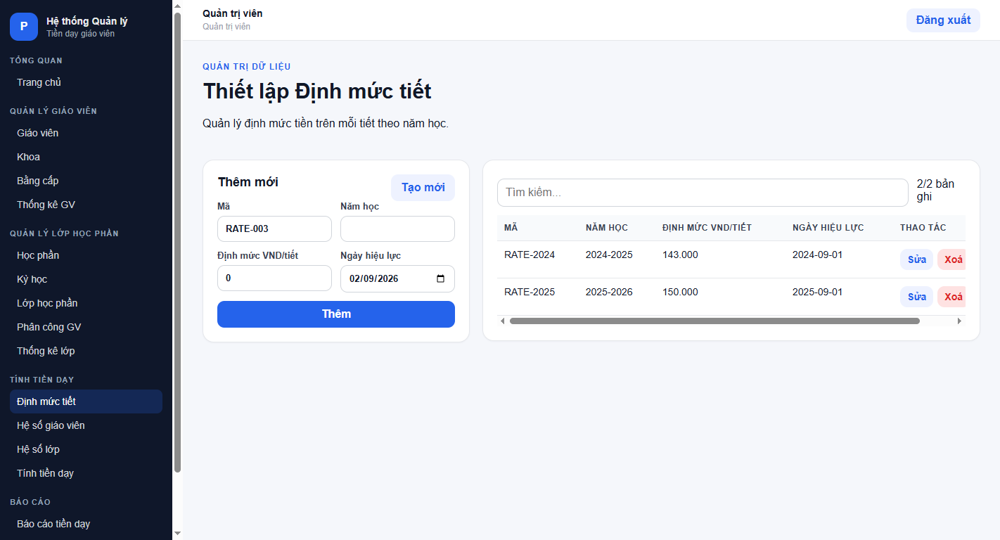 | 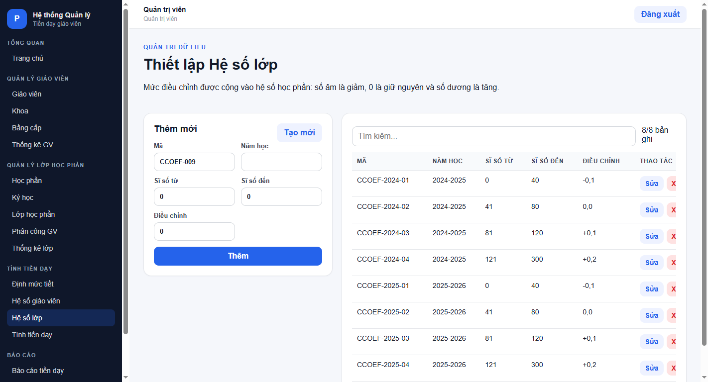 |

---

### Các Điểm sáng về Trải nghiệm Người dùng (UX Highlights)

- ⚡ **Batch Operations (Tạo nhiều lớp tự động):** Người dùng chỉ cần chọn học phần, nhập tiền tố mã và số lượng lớp cần mở, hệ thống sẽ tự động tính toán mã số kế tiếp và sinh đồng loạt, tiết kiệm 90% thời gian nhập liệu.
- 📋 **Sao chép Hệ số từ Năm học Trước:** Cho phép kế thừa toàn bộ cấu hình hệ số bằng cấp của năm học cũ sang năm học mới chỉ trong 1 thao tác chọn năm nguồn $\to$ năm đích.
- 🛡️ **Cơ chế Tính toán An toàn (Safe Payroll Mode):** Khi xảy ra thiếu sót cấu hình (chưa nhập định mức hoặc thiếu hệ số của một bằng cấp mới tạo), phần mềm không bị crash màn hình trắng mà tách riêng các dòng lỗi ra hộp thoại thông báo màu đỏ, chỉ rõ nguyên nhân và hướng xử lý cho quản trị viên.
- 🔒 **Phân quyền Giao diện Động (Role-Based Dynamic UI):**
  - **Tài khoản Admin:** Xem, thêm, sửa, xóa, phân công, tính tiền, xuất báo cáo và reset hệ thống.
  - **Tài khoản Tester:** Chế độ xem an toàn (Read-only), form thao tác tự động chuyển sang trạng thái vô hiệu hóa hoặc ẩn các nút Xóa/Reset, ngăn ngừa rủi ro can thiệp dữ liệu ngoài ý muốn.
- 🔍 **Tìm kiếm & Lọc Dữ liệu Thời gian thực:** Mọi bảng dữ liệu đều được trang bị ô tìm kiếm nhanh (theo Mã, Tên, Khoa, Trạng thái) với tốc độ phản hồi tức thời dưới 10ms.

---

## 🏗️ Kiến trúc Hệ thống & Công nghệ Áp dụng

Ứng dụng được thiết kế theo kiến trúc phân tầng hiện đại (**Layered Architecture**), tách bạch rõ ràng giữa Presentation, Application Service, Domain Calculation và Data Persistence.

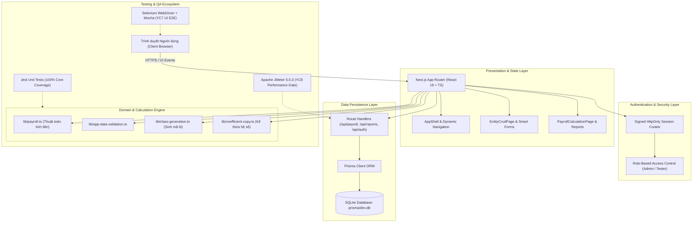

### Danh mục Công nghệ Cốt lõi (Tech Stack)

| Hạng mục | Công nghệ sử dụng | Phiên bản | Vai trò & Đặc tính |
|---|---|---|---|
| **Frontend Framework** | Next.js (App Router) | 14.2+ | Tối ưu Server-Side Rendering và Client Components linh hoạt |
| **Giao diện & Ngôn ngữ** | React, TypeScript, Vanilla CSS | 18, 5.x | Hệ thống kiểu dữ liệu tĩnh an toàn, CSS biến tùy biến linh hoạt |
| **Cơ sở Dữ liệu** | SQLite + Prisma ORM | 5.x | CSDL quan hệ chuẩn hóa, dễ dàng triển khai cục bộ và kiểm thử |
| **Bảo mật & Phiên** | HttpOnly Cookie + HMAC-SHA256 | Native Crypto | Chống XSS/CSRF, bảo vệ thông tin phiên đăng nhập |
| **Unit Testing** | Jest + ts-jest + Istanbul | 29.x | Kiểm thử đơn vị logic nghiệp vụ, đo lường độ bao phủ 100% |
| **UI Automation (YC7)** | Selenium WebDriver + Mocha | 4.27+, 11.x | Tự động hóa kiểm thử giao diện theo mô hình Page Object Model |
| **Performance (YC8)** | Apache JMeter + Node.js Gate | 5.6.3 | Kiểm thử tải, thời gian phản hồi, thông lượng và tỷ lệ lỗi |

---

## 📋 Danh mục Màn hình & Nghiệp vụ

Hệ thống bao gồm **16 màn hình & module chức năng** hoàn chỉnh:

1. **Đăng nhập (`/login`):** Xác thực tài khoản với mật khẩu mã hóa, hỗ trợ hai vai trò Admin và Tester.
2. **Trang chủ (`/`):** Bảng tổng quan thông tin, hiển thị 4 KPI cards, sơ đồ luồng dữ liệu và công thức tính.
3. **Quản lý Bằng cấp (`/degrees`):** Quản lý danh mục học vị (Cử nhân, Thạc sĩ, Tiến sĩ, PGS, GS...).
4. **Quản lý Khoa (`/departments`):** Quản lý danh sách khoa viện chuyên môn, phòng ban đào tạo.
5. **Quản lý Giáo viên (`/teachers`):** Quản lý hồ sơ nhân sự, học vị, khoa trực thuộc, thông tin liên lạc và trạng thái làm việc.
6. **Thống kê Giáo viên (`/teacher-statistics`):** Báo cáo số lượng giáo viên theo khoa, bằng cấp, số tiết đã phân công.
7. **Quản lý Học phần (`/subjects`):** Quản lý số tín chỉ, hệ số học phần (lý thuyết, thực hành, chuyên ngành).
8. **Quản lý Kỳ học (`/semesters`):** Quản lý năm học, học kỳ, ngày bắt đầu/kết thúc và khóa kỳ học.
9. **Quản lý Lớp học phần (`/classes`):** Quản lý danh sách lớp, sĩ số sinh viên; hỗ trợ sinh hàng loạt lớp tự tăng mã số.
10. **Phân công Giảng viên (`/assignments`):** Điều phối giáo viên phụ trách từng lớp học phần và số tiết giảng dạy.
11. **Thống kê Lớp học phần (`/class-statistics`):** Báo cáo tình hình phân công giảng dạy của toàn bộ lớp học phần trong kỳ.
12. **Thiết lập Định mức Tiết (`/payment-rates`):** Cấu hình đơn giá thù lao 1 tiết chuẩn theo từng năm học và kỳ học.
13. **Thiết lập Hệ số Giáo viên (`/teacher-coefficients`):** Quy định hệ số thù lao theo học vị; hỗ trợ sao chép nhanh cấu hình từ năm trước.
14. **Thiết lập Hệ số Lớp (`/class-coefficients`):** Quy định hệ số phụ trội theo quy mô sĩ số sinh viên của lớp học.
15. **Tính Tiền Dạy (`/payroll`):** Tính toán chi tiết thù lao từng lớp, tổng hợp số tiền của từng giáo viên và toàn trường.
16. **Báo cáo & Hệ thống (`/reports` & `/system`):** Bộ lọc báo cáo đa chiều, trích xuất dữ liệu CSV, in/lưu PDF chuẩn A4, và công cụ Reset dữ liệu demo.

---

## 🧮 Công thức & Quy chuẩn Nghiệp vụ Tính Tiền Dạy

Công thức tính thù lao giảng dạy được chuẩn hóa theo quy chế đào tạo đại học và bám sát đặc tả nghiệp vụ:

$$\text{Tiền dạy mỗi lớp} = \text{Số tiết} \times (\text{Hệ số học phần} + \text{Hệ số lớp}) \times \text{Định mức tiết} \times \text{Hệ số bằng cấp}$$

### Giải thích các đại lượng:
- **Số tiết ($N$):** Tổng số tiết giảng dạy thực tế được phân công cho lớp học phần.
- **Hệ số học phần ($K_{hp}$):** Hệ số độ phức tạp của môn học (ví dụ: lý thuyết đại cương = $1.0$, chuyên ngành/thực hành = $1.2$ - $1.5$).
- **Hệ số lớp ($K_{lop}$):** Hệ số điều chỉnh dựa trên sĩ số sinh viên thực tế (ví dụ: lớp $\le 40$ SV hệ số $0$, lớp $41 - 70$ SV hệ số $0.1$, lớp $> 70$ SV hệ số $0.2$).
- **Định mức tiết ($D$):** Đơn giá thù lao cơ bản cho 1 tiết chuẩn (VNĐ/tiết) quy định theo từng kỳ học của năm học tương ứng.
- **Hệ số bằng cấp ($K_{bc}$):** Hệ số ưu đãi theo học vị/học hàm cao nhất của giảng viên trong năm học (Thạc sĩ = $1.2$, Tiến sĩ = $1.5$, PGS = $1.8$, GS = $2.0$).

---

## 🚀 Hướng dẫn Cài đặt & Khởi chạy Nhanh

### Yêu cầu Tiên quyết về Môi trường
- **Node.js:** Phiên bản 20.x trở lên (Khuyến nghị Node.js 22 LTS).
- **Google Chrome:** Cài đặt sẵn trên máy (dùng cho kiểm thử UI Selenium).
- **Java:** JRE/JDK 11 trở lên trong biến môi trường `PATH` (dùng cho Apache JMeter).
- **Apache JMeter:** Đã tích hợp sẵn tại `tools/apache-jmeter-5.6.3` trong thư mục dự án.

### Các Bước Cài đặt & Khởi động Ứng dụng

Mở Terminal / PowerShell tại thư mục gốc dự án:

```powershell
# 1. Di chuyển vào thư mục ứng dụng
cd source/teacher-payroll-app

# 2. Cài đặt các gói phụ thuộc
npm install

# 3. Đồng bộ lược đồ CSDL SQLite và nạp dữ liệu khởi tạo (Seed data)
npm run db:deploy
npm run db:seed

# 4. Khởi động ứng dụng
npm run dev
```

Truy cập ứng dụng tại: `http://localhost:3000` (hoặc `http://127.0.0.1:3000`).

### Thông tin Tài khoản Đăng nhập Mặc định

| Tài khoản | Mật khẩu | Vai trò (Role) | Phạm vi Quyền hạn |
|---|---|---|---|
| `admin` | `admin@123` | **Quản trị viên (Admin)** | Toàn quyền: Thêm, Sửa, Xóa, Cấu hình hệ số, Tính tiền, Báo cáo, Reset hệ thống |
| `tester` | `tester@123` | **Kiểm thử viên (Tester)** | Quyền xem: Tra cứu dữ liệu, Xem tính tiền, Xuất báo cáo (Bị giới hạn can thiệp CSDL) |

---

## 🧪 Hướng dẫn Kiểm thử Toàn diện (QA & Automation Tests)

### 1. Kiểm thử Đơn vị & Độ bao phủ (Jest)

Toàn bộ các hàm tính toán tiền dạy, kiểm tra tính hợp lệ của dữ liệu, thuật toán sinh mã lớp và kế thừa hệ số đều được bảo vệ bởi bộ Unit Test Jest.

```powershell
# Chạy từ thư mục gốc
npm run test:unit

# Xem báo cáo độ bao phủ chi tiết (Code Coverage)
npm run coverage
```

> **Kết quả kiểm thử:** Đạt **100% Statement, Branch, Function và Line Coverage** đối với toàn bộ các module nghiệp vụ lõi (`payroll.ts`, `app-data-validation.ts`, `coefficient-copy.ts`, `class-generation.ts`).

---

### 2. Kiểm thử Giao diện Tự động (YC7 - Selenium WebDriver)

Bộ kiểm thử YC7 được xây dựng trên nền tảng **JavaScript + Mocha + Selenium WebDriver** áp dụng triệt để mô hình **Page Object Model (POM)**:
- Tự động kiểm tra luồng đăng nhập đúng/sai, phân quyền Admin vs Tester.
- Tự động thực thi các thao tác CRUD danh mục bằng cấp, giáo viên, lớp học.
- Kiểm tra tự động hóa luồng nghiệp vụ Phân công $\to$ Tính tiền $\to$ Báo cáo.

#### Cách chạy tự động bằng Script (Khuyến nghị trên Windows):
Đảm bảo ứng dụng đang chạy tại cổng `3000` (`npm run start` trên bản build), mở một cửa sổ PowerShell mới:

```powershell
# Chạy toàn bộ 21 test case ở chế độ Headless
./scripts/run-yc7.ps1

# Hoặc quan sát trực tiếp trình duyệt Chrome tự động thao tác
./scripts/run-yc7.ps1 -Headless:$false
```

#### Cách chạy thủ công bằng CLI:
```powershell
cd tests/selenium-js
npm install
$env:BASE_URL="http://127.0.0.1:3000"; $env:BROWSER="chrome"; npm run test:junit
```

- **Báo cáo kết quả JUnit XML:** `tests/selenium-js/reports/junit/yc7-selenium-results.xml`
- **Ảnh chụp màn hình:** Khi phát hiện lỗi hoặc assert fail, ảnh chụp sẽ tự động lưu vào `evidence/screenshots/`.
- **Kết quả thực tế:** **21/21 Test Cases PASS tuyệt đối (100%)**.

---

### 3. Kiểm thử Hiệu năng & Chịu tải (YC8 - Apache JMeter)

Bộ kịch bản YC8 mô phỏng tải thực tế với **50 người dùng đồng thời (Virtual Users)**, thực hiện lặp 10 chu kỳ (**1.550 mẫu request**) nhắm vào các API trọng yếu: `/api/health`, `/api/payroll`, `/api/reports`.

Hệ thống tích hợp công cụ kiểm định chất lượng hiệu năng tự động (**Performance Quality Gate** qua `check-thresholds.mjs`):
- **Thời gian phản hồi trung bình (Average Response Time):** $\le 1000$ ms
- **Phân vị 95% (95th Percentile Response Time):** $\le 2000$ ms
- **Tỷ lệ lỗi cho phép (Error Rate):** $\le 1\%$

#### Chạy kiểm thử non-GUI và đánh giá Performance Gate:
```powershell
./scripts/run-yc8.ps1 -JMeterBin "tools\apache-jmeter-5.6.3\bin\jmeter.bat"
```

#### Kết quả Đo lường Tham chiếu (Thực tế):
- **Average Response Time:** **8.96 ms** (Vượt xa ngưỡng yêu cầu $\le 1000$ ms)
- **95th Percentile (P95):** **35.00 ms** (Vượt xa ngưỡng yêu cầu $\le 2000$ ms)
- **Error Rate:** **0.00%** (Hoàn hảo, không có bất kỳ request lỗi nào)
- **Throughput:** **78.10 requests/giây**
- **Đánh giá chung:** **PASSED ALL PERFORMANCE GATES** 🟢

#### Mở JMeter ở chế độ Giao diện (GUI Mode để quan sát trực quan):
```powershell
./scripts/open-jmeter-gui.ps1
```

- **File kết quả chi tiết:** `evidence/jmeter-results/yc8-payroll-results.jtl`
- **Báo cáo HTML Dashboard tương tác:** `evidence/jmeter-results/html-report/index.html`

---

### 4. Chạy Toàn bộ Pipeline Kiểm thử Local

Để thực hiện chu trình kiểm định hoàn chỉnh từ Build ứng dụng, khởi tạo DB tạm, chạy Unit Test, Selenium E2E và JMeter Performance:

```bash
npm run qa:yc7-yc8
```

---

## 🔄 Tích hợp Liên tục (CI/CD Workflow)

Dự án cấu hình sẵn pipeline kiểm định tự động thông qua **GitHub Actions** tại tệp:  
[`.github/workflows/yc7-yc8-qa.yml`](.github/workflows/yc7-yc8-qa.yml)

Quy trình hoạt động trên môi trường máy ảo Ubuntu:
1. **Thiết lập Môi trường:** Cài đặt Node.js 20 và Java 11.
2. **Kiểm thử Đơn vị & Cơ sở Dữ liệu:** Chạy Jest test suite, thực hiện Prisma migrate và seed CSDL SQLite riêng cho CI.
3. **Build & Khởi động Ứng dụng:** Build phiên bản production của Next.js và khởi chạy nền, đợi endpoint `/api/health` sẵn sàng.
4. **Kiểm thử Giao diện (YC7):** Khởi chạy 21 test case Selenium WebDriver trên Google Chrome Headless.
5. **Cài đặt & Chạy Kiểm thử Hiệu năng (YC8):** Tải Apache JMeter, thực hiện tải 50 VUsers và kiểm tra Performance Gate.
6. **Lưu trữ Bằng chứng (Artifacts Upload):** Đóng gói và upload tự động các tệp JUnit XML, Screenshot, file `.jtl` và HTML Dashboard lên GitHub Artifacts.

---

## 📁 Cấu trúc Thư mục Dự án

```text
software-testing-and-evaluation/
├── .github/
│   └── workflows/
│       └── yc7-yc8-qa.yml         # CI/CD pipeline tự động hóa
├── docs/                           # Thư mục hồ sơ & tài liệu kiểm thử SQA
│   ├── 01_SRS_Dac_ta_yeu_cau.docx
│   ├── 02_SQA_Test_Plan.docx
│   ├── 03_Test_Execution_and_Review_Report.docx
│   ├── 05_Project_Artifacts_Checklists_Traceability.xlsx
│   ├── 07_Selenium_WebDriver_Test_Report.docx
│   ├── 08_JMeter_Performance_Test_Report.docx
│   ├── 10_Huong_dan_chay_test_YC7_YC8_Windows.md
│   └── images/                    # Thư viện ảnh chụp giao diện UI/UX
│       ├── 01_login_page.png
│       ├── 02_dashboard.png
│       ├── 03_teachers_management.png
│       ├── 04_classes_management.png
│       ├── 05_teaching_assignments.png
│       ├── 06_payroll_calculation.png
│       ├── 07_payroll_reports.png
│       ├── 08_teacher_statistics.png
│       ├── 09_payment_rates.png
│       └── 10_class_coefficients.png
├── evidence/                       # Bằng chứng thực thi kiểm thử thực tế
│   ├── db-sqlite/                 # Bằng chứng kiểm tra tính toàn vẹn CSDL SQLite
│   ├── jmeter-results/            # File .jtl và HTML Dashboard báo cáo hiệu năng
│   └── screenshots/               # Ảnh chụp kiểm thử giao diện tự động
├── scripts/                        # Scripts hỗ trợ chạy kiểm thử trên Windows & Linux
│   ├── open-jmeter-gui.ps1        # Mở nhanh giao diện JMeter GUI
│   ├── run-yc7.ps1                # Chạy tự động Selenium trên Windows
│   ├── run-yc8.ps1                # Chạy tự động JMeter và gate trên Windows
│   └── run-yc7-yc8.sh             # Script chạy liên hoàn YC7 + YC8
├── source/
│   └── teacher-payroll-app/       # Mã nguồn chính ứng dụng Next.js/TypeScript
│       ├── prisma/                # Schema Prisma và file CSDL dev.db
│       ├── src/
│       │   ├── app/               # 17 routes và REST API handlers
│       │   ├── components/        # Các UI Components (AppShell, CrudPage, Dashboard...)
│       │   └── lib/               # Module nghiệp vụ lõi (Payroll, Auth, Validation...)
│       └── package.json
├── tests/
│   ├── jmeter/                    # Bộ kịch bản JMeter (.jmx, CSV data, checker gate)
│   ├── selenium/                  # Kịch bản Selenium Python (legacy reference)
│   └── selenium-js/               # Bộ kịch bản Selenium WebDriver JS (Chính thức YC7)
├── tools/
│   └── apache-jmeter-5.6.3/       # Bộ công cụ Apache JMeter tích hợp sẵn
└── package.json                   # File quản lý lệnh tổng của dự án
```

---

## 📑 Danh mục Hồ sơ & Bằng chứng Kiểm thử (Artifacts Traceability)

Tất cả các bằng chứng kiểm thử và tài liệu đặc tả đều được đối chiếu chặt chẽ trong thư mục [`docs/`](docs/) và [`evidence/`](evidence/):

| Yêu cầu kiểm thử | Tên tài liệu / Minh chứng đi kèm | Đường dẫn lưu trữ | Trạng thái |
|---|---|---|:---:|
| **YC1 - Đặc tả Yêu cầu** | Đặc tả yêu cầu phần mềm SRS | [`docs/01_SRS_Dac_ta_yeu_cau.docx`](docs/01_SRS_Dac_ta_yeu_cau.docx) | Đầy đủ |
| **YC2 - CSDL & Backend** | Lược đồ CSDL Prisma, SQLite & Minh chứng | [`evidence/db-sqlite/`](evidence/db-sqlite/) | Đầy đủ |
| **YC3 - Giao diện UI/UX** | Thiết kế AppShell, Thư viện ảnh chụp UI | [`docs/images/`](docs/images/) | Đầy đủ |
| **YC4 - Ma trận Truy vết** | Traceability Matrix & Checklist | [`docs/05_Project_Artifacts_Checklists_Traceability.xlsx`](docs/05_Project_Artifacts_Checklists_Traceability.xlsx) | Đầy đủ |
| **YC5 - SQA Test Plan** | Kế hoạch đảm bảo chất lượng phần mềm | [`docs/02_SQA_Test_Plan.docx`](docs/02_SQA_Test_Plan.docx) | Đầy đủ |
| **YC6 - Kiểm thử Đơn vị** | Báo cáo kiểm thử Jest & Độ bao phủ 100% | [`evidence/coverage/`](evidence/coverage/) | Đầy đủ |
| **YC7 - UI Automation** | Báo cáo kiểm thử tự động Selenium WebDriver | [`docs/07_Selenium_WebDriver_Test_Report.docx`](docs/07_Selenium_WebDriver_Test_Report.docx) | PASS 21/21 |
| **YC8 - Performance Test** | Báo cáo hiệu năng JMeter & HTML Dashboard | [`evidence/jmeter-results/html-report/`](evidence/jmeter-results/html-report/) | Gate PASS |
| **YC9 - Báo cáo Tổng kết** | Báo cáo thực thi kiểm thử & Đánh giá chất lượng | [`docs/03_Test_Execution_and_Review_Report.docx`](docs/03_Test_Execution_and_Review_Report.docx) | Đầy đủ |

---

## 👥 Nhóm Thực Hiện
- **Lớp / Học phần:** Đảm bảo Chất lượng & Kiểm thử Phần mềm (N01)
- **Nhóm sinh viên:** Nhóm 07 (Nhóm 11)
- **Giảng viên phụ trách môn học:** Bộ môn Kỹ thuật Phần mềm
